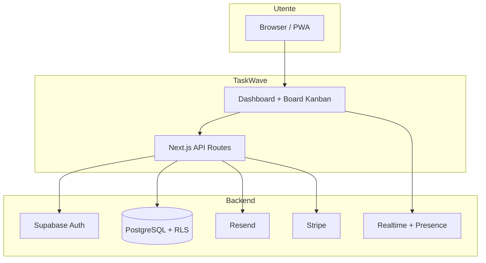

# TaskWave

**TaskWave** è una **web application di project management** basata su **board Kanban**, progettata per **team di sviluppo software, startup e project manager tecnici** che vogliono coordinare il lavoro quotidiano senza la complessità e il peso dei tool enterprise tradizionali (Jira, Azure DevOps, ecc.).

> **In sintesi:** crei workspace per i tuoi progetti, organizzi il lavoro in board con colonne (Backlog → In progress → Done), assegni task ai membri del team e tutti vedono gli aggiornamenti **in tempo reale** — dal browser o come PWA installabile. Parti **gratis**; paghi solo se ti servono inviti email, allegati, API o integrazioni avanzate.

**Demo live:** [taskwave-rust.vercel.app](https://taskwave-rust.vercel.app) — dominio canonico finché `taskwave.vercel.app` non viene riassegnato nel dashboard Vercel (attualmente punta a un deploy obsoleto).

---

## Indice

- [A cosa serve TaskWave](#a-cosa-serve-taskwave)
- [Per chi è pensato](#per-chi-è-pensato)
- [Problemi che risolve](#problemi-che-risolve)
- [Casi d'uso concreti](#casi-duso-concreti)
- [Come funziona (modello concettuale)](#come-funziona-modello-concettuale)
- [Flusso utente tipico](#flusso-utente-tipico)
- [Funzionalità complete](#funzionalità-complete)
- [Piani e prezzi](#piani-e-prezzi)
- [Privacy e sicurezza](#privacy-e-sicurezza)
- [Architettura tecnica](#architettura-tecnica)
- [Setup locale](#setup-locale)
- [Deploy](#deploy)
- [Test e documentazione](#test-e-documentazione)

---

## A cosa serve TaskWave

TaskWave esiste per **centralizzare lo stato del lavoro di un team** in un unico posto visibile e aggiornato. Invece di chiedere “a che punto siamo?” su Slack, aggiornare un foglio Google o aprire ticket su sistemi pensati per ITIL, TaskWave offre:

1. **Una board Kanban** dove ogni task è una card spostabile tra colonne (stati del flusso).
2. **Workspace separati** per progetti, clienti o squadre diverse.
3. **Collaborazione live** — se un collega sposta un task o aggiunge un commento, lo vedi subito senza ricaricare la pagina.
4. **Notifiche** quando vieni assegnato, quando qualcuno commenta o quando un task cambia colonna.
5. **Account e permessi** — ogni membro ha un ruolo (admin o member); gli admin gestiscono inviti e impostazioni.

Non è un ERP, non è un CRM e non è un wiki. È uno **strumento operativo giornaliero**: apri la board al mattino, vedi cosa c’è in coda, sposti le card man mano che consegni, chiudi la giornata con la colonna “Done” aggiornata.

### Cosa TaskWave **non** fa (per scelta)

- Workflow multi-livello con 50 stati obbligatori e approvazioni gerarchiche
- Time tracking integrato o fatturazione ore
- Gantt chart enterprise o capacity planning avanzato
- Sostituire completamente Jira in organizzazioni con migliaia di utenti e processi ISO certificati

TaskWave punta a **velocità, chiarezza e zero attrito** — ideale per team che preferiscono *shipping* a *configurazione infinita*.

---

## Per chi è pensato

| Profilo | Come usa TaskWave |
|---------|-------------------|
| **Developer / Tech lead** | Board per sprint o feature; assignee su ogni task; sync realtime durante pair programming o review |
| **Project manager** | Vista Kanban per stand-up; filtri per priorità e assignee; scadenze (Pro) e timeline attività |
| **Founder / startup** | Workspace per prodotto; piano Free per iniziare; upgrade a Pro quando il team cresce |
| **Freelancer con clienti** | Workspace separati per cliente; guest link (Business) per condividere avanzamento read-only |
| **Team remote** | Presence (“N online” sulla board), notifiche, inviti email, stesso stato ovunque |

---

## Problemi che risolve

| Senza TaskWave | Con TaskWave |
|----------------|--------------|
| “Chi sta lavorando su cosa?” → domande ripetute in chat | Assignee visibile su ogni card; filtri per persona |
| Stato del progetto disperso in thread Slack | Una board = una fonte di verità |
| Due persone modificano la stessa lista e si sovrascrivono | Realtime Supabase: aggiornamenti istantanei |
| Tool gratuiti limitati o tool enterprise costosi | Free generoso; Pro/Business solo se servono integrazioni |
| Privacy trascurata nei SaaS gratuiti | Opt-out IP, export GDPR, 2FA, cookie consent integrati |

---

## Casi d'uso concreti

### 1. Sprint settimanale di un team dev (5 persone)

- Il tech lead crea un workspace **“Prodotto Alpha”** e una board **“Sprint 12”** con colonne `Backlog | In progress | Review | Done`.
- Importa o crea task da template Scrum.
- Assegna card ai developer; ognuno trascina le proprie in **In progress** e poi in **Done** a fine giornata.
- Il PM apre la board durante lo stand-up: nessuno deve aggiornare slide — la board *è* lo stand-up.

### 2. Bug tracker leggero

- Board con colonne `Reported | Triaged | Fixing | Verified | Closed`.
- Priorità alta/media/bassa sulle card.
- Commenti sul task per note di riproduzione (Pro).
- Notifica al developer quando un bug gli viene assegnato.

### 3. Onboarding di un nuovo membro

- Admin invia **invito email** (Pro+); il nuovo utente accetta da `/invite/[token]`.
- Wizard di onboarding al primo login: crea workspace, prima board, primo task.
- Command palette `⌘K` per scoprire navigazione e scorciatoie.

### 4. Integrazione con pipeline CI (Business)

- Webhook outbound su evento “task spostato in Done” → chiama endpoint interno o Slack incoming webhook.
- REST API v1 per creare/aggiornare task da script o da GitHub Actions.
- Audit log per tracciare chi ha modificato cosa.

---

## Come funziona (modello concettuale)

TaskWave organizza i dati in una gerarchia semplice:

```
Account (utente registrato)
  └── Workspace          ← es. "Acme Corp", "Side project"
        ├── Membri       ← admin | member
        ├── Board        ← es. "Sprint 12", "Bug backlog"
        │     ├── Colonna    ← es. "To Do", "Doing", "Done"
        │     │     └── Task       ← titolo, priorità, assignee, scadenza, commenti, allegati
        │     └── ...
        └── Impostazioni   ← webhook, custom fields, audit (Business)
```



Ogni **task** vive in una **colonna** di una **board** dentro un **workspace**. I permessi sono enforced a livello database con **Row Level Security (RLS)**: un utente vede solo i workspace di cui è membro.

---

## Flusso utente tipico

1. **Registrazione** → `/register` (email + password, Supabase Auth)
2. **Onboarding** → creazione primo workspace e board (wizard)
3. **Dashboard** → `/dashboard` — elenco workspace, board, inviti pendenti, pannello team
4. **Board** → `/workspace/[id]/board/[boardId]` — Kanban drag-and-drop, filtri, timeline, presence
5. **Dettaglio task** → sheet laterale: edit titolo, priorità, assignee, commenti, allegati
6. **Impostazioni account** → profilo, tema, notifiche, **privacy** (opt-out, export, delete), **sicurezza** (password, 2FA)
7. **Upgrade** → `/pricing` → Stripe Checkout → piano Pro/Business sincronizzato su `profiles.plan`

---

## Funzionalità complete

### Workspace e team

- Workspace multipli (limite per piano)
- Ruoli **admin** / **member**
- Inviti email con token (`/invite/[token]`) — Pro+
- Rimozione membri, cambio ruolo, leave workspace
- Accent color per workspace (Pro+)
- Workspace privati (Business)

### Board Kanban

- Colonne standard o personalizzate (Pro+)
- **Drag-and-drop** fluido tra colonne
- Template: Kanban classico, Scrum, bug tracker
- Filtri per priorità e assignee
- Vista **timeline** attività
- **Presence**: “N persone online” (Supabase Presence)
- Guest link read-only con scadenza (Business)

### Task

- Titolo, descrizione, priorità (alta/media/bassa)
- Assignee (membro del workspace)
- Scadenza `due_date` (Pro+)
- Commenti con notifiche (Pro+)
- Allegati su Supabase Storage (Pro: 25 MB, Business: 100 MB)
- Custom fields workspace — testo, numero, select (Business)

### Realtime e notifiche

- **Supabase Realtime** sulla board: create/update/delete task e colonne
- Inbox notifiche in-app (assegnazione, commento, spostamento)
- Email opzionali via **Resend** (toggle per tipo in impostazioni)
- Activity feed nel workspace

### Produttività

- **Command palette** (`⌘K` / `Ctrl+K`)
- Onboarding guidato al primo accesso
- **PWA** — manifest, service worker, installabile
- Tema dark / light / system

### Business e integrazioni

- **REST API v1** — workspaces, boards, tasks, members (Bearer API key)
- **API keys** per workspace — generazione e revoca
- **Webhook outbound** — eventi task con firma HMAC (`X-TaskWave-Signature`)
- **Audit log** — azioni critiche + export CSV
- **SSO/SAML** — configurazione su richiesta (placeholder `/api/sso/status`)

Documentazione API: [`/docs`](https://taskwave-rust.vercel.app/docs)

### Sito pubblico

| Pagina | Scopo |
|--------|--------|
| `/` | Landing — value proposition e anteprima board |
| `/features` | Funzionalità in stile product page (animazioni scroll) |
| `/pricing` | Piani Free / Pro / Business + FAQ |
| `/about` | Storia, principi, stack, visione del prodotto |
| `/blog` | Articoli da `content/blog/*.md` |
| `/privacy`, `/terms` | Documenti legali |
| `/privacy/opt-out` | Opt-out tracciamento IP (anonimi + email) |
| Header **Contattaci** | Form → `POST /api/contact` → Resend |

---

## Piani e prezzi

| | **Free** | **Pro** €12/mo | **Business** €29/mo |
|---|:---:|:---:|:---:|
| Workspace | 3 | ∞ | ∞ |
| Membri / workspace | 5 | 20 | ∞ |
| Board / workspace | 3 | ∞ | ∞ |
| Kanban + realtime | ✓ | ✓ | ✓ |
| Colonne custom | — | ✓ | ✓ |
| Scadenze, commenti, allegati | — | ✓ (25 MB) | ✓ (100 MB) |
| Inviti email | — | ✓ | ✓ |
| Analytics + export CSV | — | ✓ | ✓ |
| API keys + REST API | — | — | ✓ |
| Webhook + audit log | — | — | ✓ |
| Guest link | — | — | ✓ |
| SSO/SAML | — | — | su richiesta |

Checkout **Stripe** (test mode in sviluppo). Portale fatturazione per upgrade/downgrade/cancellazione.

---

## Privacy e sicurezza

TaskWave tratta privacy e sicurezza come parte del prodotto:

- **Opt-out IP** — pagina pubblica, toggle account, cookie, GPC/DNT; IP mai in chiaro (hash SHA-256 + `PRIVACY_IP_SALT`)
- **Cookie consent** — banner; sync preferenze se loggato
- **GDPR** — export JSON (`GET /api/profile/export`), delete account (`POST /api/profile/delete-account`)
- **2FA TOTP** — Supabase MFA in Impostazioni → Sicurezza
- **Rate limiting** — invite, opt-out, delete account, form contatto
- **CSP** + security headers (`X-Frame-Options`, `Referrer-Policy`, …)
- **RLS PostgreSQL** — ogni tabella protetta per utente/workspace; limiti piano enforced server-side (migration 014)

Dettagli operativi: [`docs/BACKUP.md`](docs/BACKUP.md), [`docs/MONITORING.md`](docs/MONITORING.md)

---

## Architettura tecnica

| Layer | Tecnologia |
|-------|------------|
| Frontend | Next.js 14 (App Router), React 18, TypeScript, Tailwind, shadcn/ui, Framer Motion |
| Auth & DB | Supabase — PostgreSQL, Auth, Realtime, Storage |
| Pagamenti | Stripe Checkout + Customer Portal + webhooks |
| Email | Resend (auth, inviti, opt-out, contatto) |
| Deploy | Vercel (progetto `taskwave`) |
| E2E | Playwright |

```
src/
├── app/                 # Pagine + API routes
│   ├── (dashboard)/     # Area autenticata
│   ├── (auth)/          # Login, register, reset
│   ├── api/             # REST interno, v1, Stripe, privacy
│   └── about|features|pricing|blog|privacy|terms
├── components/          # UI, workspace panels, marketing
├── hooks/               # Realtime, presence
├── lib/                 # Supabase, data layer, plans, privacy, webhooks
content/blog/            # Articoli markdown
supabase/migrations/     # Schema SQL 001–014
e2e/                     # Test Playwright
docs/                    # Backup, monitoring
```

**Backend legacy:** `backend/` (Django) è **deprecato** — non usato in produzione. Vedi [`backend/DEPRECATED.md`](backend/DEPRECATED.md).

---

## Setup locale

```bash
git clone https://github.com/niccolopiccioli/taskwave.git
cd taskwave
npm install
cp .env.example .env.local   # compila Supabase, Stripe, Resend, PRIVACY_IP_SALT
npm run dev                    # http://localhost:3000
```

### Supabase

- Progetto: `lcubcugivegahjsbmepy` (eu-west-1)
- Applica migrazioni in `supabase/migrations/` (001 → 014)
- Auth → URL: `http://localhost:3000/auth/callback` (+ dominio produzione)

### Stripe (test)

```bash
stripe listen --forward-to localhost:3000/api/stripe/webhook
# Carta test: 4242 4242 4242 4242
```

Variabili complete: [`.env.example`](.env.example)

---

## Deploy

```bash
vercel deploy --prod
```

- **Progetto Vercel:** `taskwave`
- **URL produzione:** [taskwave.vercel.app](https://taskwave-rust.vercel.app)
- Imposta `NEXT_PUBLIC_APP_URL=https://taskwave-rust.vercel.app` su Vercel (progetto **taskwave**)

---

## Test e documentazione

```bash
npm run test:e2e
npx playwright install   # primo utilizzo
```

I test coprono landing, pricing, blog, opt-out privacy, redirect auth e board.

---

## Contatti

- **Sito:** [taskwave.vercel.app](https://taskwave-rust.vercel.app)
- **Form:** pulsante “Contattaci” nell’header del sito
- **Email:** `hello@taskwave.app`

---

*TaskWave — Kanban per team che consegnano.*
