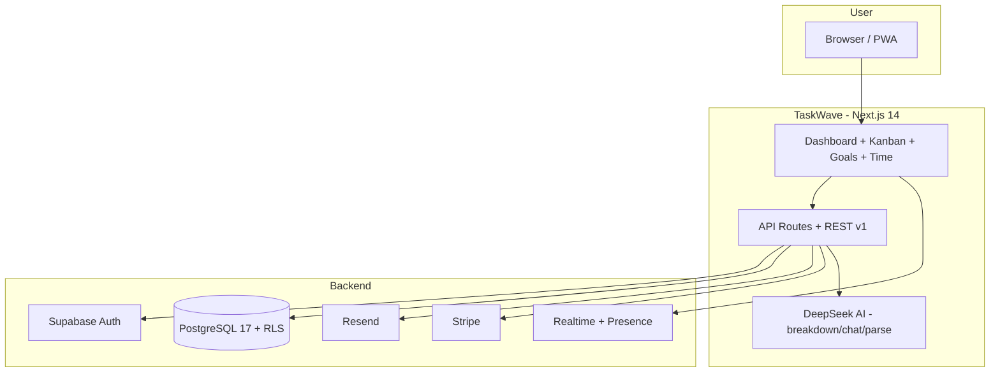

# TaskWave

**TaskWave** is a **Kanban-based project management web app** for **software teams, startups, and technical project managers** who want to coordinate daily work without the complexity of enterprise tools (Jira, Azure DevOps, etc.).

> **In short:** create workspaces, organize work on boards with columns (Backlog → In progress → Done), assign tasks, track time and goals, and see updates **in real time** — in the browser or as an installable PWA. Start **free**; pay only for Pro/Business limits and integrations.

**Live demo:** [taskwave-rust.vercel.app](https://taskwave-rust.vercel.app)

---

## Table of contents

- [What TaskWave is for](#what-taskwave-is-for)
- [Who it is for](#who-it-is-for)
- [Problems it solves](#problems-it-solves)
- [Concrete use cases](#concrete-use-cases)
- [How it works (conceptual model)](#how-it-works-conceptual-model)
- [Typical user flow](#typical-user-flow)
- [Full feature list](#full-feature-list)
- [Plans and pricing](#plans-and-pricing)
- [Privacy and security](#privacy-and-security)
- [Technical architecture](#technical-architecture)
- [Local setup](#local-setup)
- [Deploy](#deploy)
- [Tests and documentation](#tests-and-documentation)

---

## What TaskWave is for

TaskWave **centralizes your team's work status** in one visible, up-to-date place:

1. **A Kanban board** where each task is a card you move between columns, with list / calendar / Gantt / timeline views.
2. **Separate workspaces** for projects, clients, or squads, with admin/member roles.
3. **Live collaboration** — moves, comments, and task changes sync instantly via Supabase Realtime + Presence ("N online").
4. **Execution layer** — dependencies, recurring tasks, checklist/tags, time tracking, goals (OKR), automations, and AI task breakdown.
5. **External surface** — guest read-only board links, REST API v1, API keys, outbound webhooks with HMAC, GitHub integration.

It is not an ERP, CRM, or wiki. It is a **daily operational tool**: open the board in the morning, move cards as you ship, end the day with an updated "Done" column.

### What TaskWave **does not** do (by design)

- Multi-level workflows with dozens of mandatory states and hierarchical approvals
- Built-in invoicing / billable-hours accounting (time entries are operational, not fiscal)
- Enterprise Gantt resource planning or ISO-certified process enforcement
- Replacing Jira in orgs with thousands of users

Focus: **speed, clarity, zero friction**.

---

## Who it is for

| Profile | How they use TaskWave |
|---------|------------------------|
| **Developer / Tech lead** | Sprint boards, assignees, GitHub branch/PR links, realtime sync during pairing or review |
| **Project manager** | Kanban + list/calendar/Gantt views, filters by priority/assignee/label, due dates, activity timeline |
| **Founder / startup** | Workspace per product, Free to start, Pro as the team grows |
| **Freelancer with clients** | Workspace per client, guest link (Business) to share read-only progress |
| **Remote team** | Presence, notifications inbox, email invites, same state everywhere |

---

## Problems it solves

| Without TaskWave | With TaskWave |
|------------------|---------------|
| "Who is working on what?" in chat | Assignee + presence visible on every card; filter by person |
| Status scattered across Slack threads | One board = one source of truth, with timeline + audit log |
| Overwrites when two people edit | Supabase Realtime: instant updates, task events API |
| Vague tasks nobody starts | AI breakdown/parse/summarize (DeepSeek) + checklist + dependencies |
| No idea where time goes | Timer start/stop, time entries, per-workspace report |
| Status meetings need slides | Board *is* the stand-up; Gantt/calendar views included |

---

## Concrete use cases

### 1. Weekly dev team sprint (5 people)

Tech lead creates workspace **"Product Alpha"**, board **"Sprint 12"** (`Backlog | In progress | Review | Done`), clones a starter template, assigns cards, links GitHub branches/PRs. PM runs stand-up from the board.

### 2. Lightweight bug tracker

Board `Reported | Triaged | Fixing | Verified | Closed`, priority high/medium/low, labels, comments, task dependencies (`blocks/relates/duplicates`), notifications on assignment.

### 3. Client work with guest link (Business)

Freelancer creates workspace per client, shares read-only guest board link with expiry (`/guest/board/[token]`), tracks time entries, exports report.

### 4. Recurring ops + automations (Business)

Recurring tasks (`recurrence_rule`, `generate_next_recurrence()`), automation rules (trigger/conditions/actions), outbound webhooks on task events with `X-TaskWave-Signature` HMAC, REST API v1 for scripts/CI.

---

## How it works (conceptual model)

```
Account (Supabase Auth user)
  └── Workspace          ← e.g. "Acme Corp", "Side project"
        ├── Members      ← admin | member (RLS-enforced)
        ├── Board        ← e.g. "Sprint 12"
        │     ├── Column     ← e.g. "To Do", "Doing", "Done"
        │     │     └── Task       ← title, priority, assignee, due date,
        │     │                      recurrence, dependencies, checklist, tags,
        │     │                      labels, comments, attachments, time, custom values
        │     └── Views      ← kanban | list | calendar | gantt | timeline
        ├── Goals (OKR)  ← goal_type/status, linked tasks
        ├── Time         ← timer entries + report
        ├── Automations / Webhooks / API keys / Git connections
        └── Settings     ← team, labels, custom fields, saved filters, audit
```


```mermaid
flowchart TB
  subgraph user [User]
    Browser[Browser / PWA]
  end
  subgraph app [TaskWave - Next.js 14]
    UI[Dashboard + Kanban + Goals + Time]
    API[API Routes + REST v1]
    AI[DeepSeek AI - breakdown/chat/parse]
  end
  subgraph backend [Backend]
    Auth[Supabase Auth]
    DB[(PostgreSQL 17 + RLS)]
    RT[Realtime + Presence]
    Email[Resend]
    Pay[Stripe]
  end
  Browser --> UI
  UI --> API
  API --> Auth
  API --> DB
  UI --> RT
  API --> Email
  API --> Pay
  API --> AI
```

Permissions are enforced in **PostgreSQL RLS**: users only see workspaces they belong to; plan limits (e.g. Free = 3 boards) are enforced server-side (`assert_can_create_board()`).

---

## Typical user flow

1. **Sign up** → `/register` (email + password, Supabase Auth; admin seed exists for local dev, see below)
2. **Login / recovery** → `/login`, `/forgot-password`, `/reset-password`; optional 4h step-up OTP gate at `/auth/verify-step` (off by default, `STEP_UP_OTP_ENABLED`)
3. **Onboarding** → wizard: first workspace, first board (from 4 starter templates), first task
4. **Dashboard** → `/dashboard` — workspaces, boards, pending invites banner, team panel, activity feed
5. **Board** → `/workspace/[id]/board/[boardId]` — drag-and-drop, view switcher (kanban/list/calendar/gantt/timeline), filter bar + saved filters, global search (`/api/search` FTS), bulk-action bar, timer button, AI sidebar + smart create
6. **Task detail** → sheet: title, priority, assignee, due date, recurrence picker, dependency picker, checklist, labels, comments, attachments, branches, custom values, events
7. **Goals** → `/workspace/[id]/goals` — OKR cards, create dialog, detail sheet, linked tasks
8. **Docs** → `/docs` (in-app API documentation for REST v1)
9. **Invite** → admin sends invite → `/invite/[token]` accept/decline; re-invite cancels stale pending
10. **Guest view** → `/guest/board/[token]` read-only board via guest link (expiry)
11. **Settings** → profile, theme (dark/light/system via provider), notifications, privacy (opt-out, export, delete), security (password, 2FA TOTP, step-up OTP)
12. **Upgrade** → `/pricing` → Stripe Checkout → Customer Portal → plan synced to `profiles.plan` via webhook + `sync_profile_plan()`

Public site: `/` landing, `/features`, `/pricing` (cards + comparison matrix + recommender), `/about`, `/blog` (3 posts from `content/blog`), `/templates` gallery, `/privacy`, `/terms`, `/privacy/opt-out`, `/checkout/success`, `/checkout/cancel`.

---

## Full feature list

### Workspace and team

- Multiple workspaces (limit per plan), accent color, private workspaces
- **Admin / member** roles; remove member, change role, leave workspace
- Email invites with token (`/invite/[token]`), pending-invites banner, re-invite cancels stale pending
- Team panel, activity feed, audit panel (critical actions + CSV export)

### Kanban board + views

- Standard or custom columns (Pro+), smooth **drag-and-drop**
- Views: kanban, list, calendar, Gantt, timeline (`view-switcher.tsx`, `board-timeline-view.tsx`, etc.)
- 4 starter templates (`lib/board-templates.ts`) + public templates gallery (`published_templates`) + clone API
- Filters by priority/assignee/label + global FTS search + per-workspace saved filters
- Bulk actions bar (multi-task ops), task events log (`/api/tasks/[id]/events`)
- **Presence**: "N online" via `use-board-presence.ts`; realtime via `use-board-realtime.ts`

### Tasks

- Title, description, priority (high/medium/low), assignee, `due_date` (Pro+)
- Recurrence (`recurrence_rule/end_date/parent_task_id`, `generate_next_recurrence()`)
- Dependencies (`blocks/relates/duplicates`), blockers picker
- Checklist, tags, `estimated_hours`, `completed_at/by` with auto-complete trigger
- Workspace labels + per-task labels, custom fields (text/number/select) + custom values
- Comments with notifications, attachments on Supabase Storage (Pro 25 MB, Business 100 MB)
- GitHub branch links + PR badge (`pr-badge.tsx`, `git-connection-panel.tsx`)

### Goals, time, AI

- **Goals (OKR)**: `goals` table + `goal_type/status`, card/create/detail components, link/unlink tasks
- **Time tracking**: timer start/stop button, time sheet, per-workspace report API
- **AI (DeepSeek)**: sidebar chat, smart create, endpoints `ai/breakdown|chat|parse|summarize|interactions`; Italian prompts; usage logged in `ai_interactions` with `check_ai_usage_limit()`

### Realtime and notifications

- **Supabase Realtime** on board: create/update/delete tasks and columns
- In-app notification inbox (assignment, comment, move, invited), preferences per type
- Optional emails via **Resend** (toggle per type); templates in `lib/email/resend.ts`
- Workspace activity feed

### Productivity

- **Command palette** (`⌘K` / `Ctrl+K`), onboarding wizard, global search
- **PWA** — `manifest.json` (`start_url:/dashboard`, standalone), `sw.js` (`CACHE:taskwave-static-v3`, cache-first for `/_next/static`, `pwa-register.tsx`)
- Dark / light / system theme, persisted UI store (zustand: sidebar/accent/compact/motion)
- i18n: `en|es|fr|it` catalogs, `Accept-Language` detection → `tw_locale` cookie (1yr) in middleware

### Business and integrations

- **REST API v1** — `GET /api/v1/workspaces`, `GET /api/v1/boards/[boardId]`, `GET|PATCH|DELETE /api/v1/tasks/[taskId]`, `GET /api/v1/workspaces/[id]/members` (Bearer API key)
- **API keys** per workspace — generate/revoke (`api-keys` routes)
- **Outbound webhooks** — task events with HMAC `X-TaskWave-Signature` (`lib/webhooks.ts`, SSRF-safe URL check)
- **Automation rules** — trigger/conditions/actions builder (admin-managed)
- **GitHub OAuth** — `GITHUB_CLIENT_ID/SECRET`, `/api/git/auth|callback|webhook`, encrypted tokens at rest (`AES-256-CBC`), connections per workspace
- **Audit log** — `auditLog()` via `log_audit_event` RPC + CSV export
- **SSO/SAML** — placeholder `GET /api/sso/status` (on request)

### Public site

| Page | Purpose |
|------|---------|
| `/` | Landing — value proposition and board preview |
| `/features` | Feature page (scroll animations) |
| `/pricing` | Free / Pro / Business + matrix + recommender + FAQ |
| `/templates` | Public board-template gallery + clone dialog |
| `/about` | Story, principles, stack, vision |
| `/blog` | 3 posts from `content/blog/*.md` (agile, build story, privacy opt-out) |
| `/privacy`, `/terms` | Legal documents |
| `/privacy/opt-out` | IP tracking opt-out (anonymous + email) |
| Header **Contact us** | Sheet → `POST /api/contact` → Resend |

---

## Plans and pricing

| | **Free** | **Pro €12/mo** | **Business €29/mo** |
|---|:---:|:---:|:---:|
| Workspaces | 3 | ∞ | ∞ |
| Members / workspace | 5 | 20 | ∞ |
| Boards / workspace | 3 (RLS-enforced) | ∞ | ∞ |
| Kanban + realtime + views | ✓ | ✓ | ✓ |
| Custom columns, due dates, comments, attachments | — | ✓ (25 MB) | ✓ (100 MB) |
| Time tracking + report | ✓ basic | ✓ | ✓ |
| Goals (OKR) | — | ✓ | ✓ |
| Email invites | in-app Copy-link | ✓ email | ✓ email |
| Templates + saved filters + search | ✓ | ✓ | ✓ |
| Recurrence + dependencies + labels | ✓ | ✓ | ✓ |
| Automations + custom fields | — | automations | ✓ both |
| API keys + REST API v1 | — | — | ✓ |
| Webhooks + audit log + CSV | — | — | ✓ |
| Guest link with expiry | — | — | ✓ |
| GitHub integration | — | — | ✓ |
| SSO/SAML | — | — | on request |

**Stripe** Checkout (test mode locally) + Customer Portal + `sync-session` + webhook → `sync_profile_plan()` RPC. Test card: `4242 4242 4242 4242`.

Plan logic lives in `src/lib/plans.ts` (limits/matrix/gates) + `PlanGate` component + migration `014` enforcement.

---

## Privacy and security

- **IP opt-out** — `/privacy/opt-out` page + API, account toggle, cookie, GPC/DNT honored in middleware (`x-tw-analytics: skip`); IP stored only as SHA-256 hash with `PRIVACY_IP_SALT`
- **Cookie consent** — banner + wrapper, `essential|all` in localStorage, sync when logged in
- **GDPR** — JSON export (`GET /api/profile/export`), delete account (`POST /api/profile/delete-account`), privacy preferences API
- **2FA TOTP** — Supabase MFA in Settings → Security; optional step-up OTP after login (`step_up_otp_challenges` table, 4h cookie, `STEP_UP_OTP_ENABLED=false` by default)
- **Rate limiting** — in-memory token bucket (`lib/rate-limit.ts`), per-action IP-hashed checks (invite, opt-out, delete account, contact)
- **Headers** — `next.config.mjs`: `X-Frame-Options:DENY`, `nosniff`, `Referrer-Policy`, `Permissions-Policy`, CSP (self + Supabase local/prod + Stripe + Sentry + Fonts)
- **RLS everywhere** — every table scoped to workspace membership; billing columns guarded by trigger; storage RLS; `service_role` bypass only via `app.allow_plan_sync` flag
- **Middleware** — Supabase session refresh, auth redirects (`/dashboard|/workspace/*`→login, logged-in `/`→dashboard), 401 JSON for protected API prefixes, public prefixes allowlist (webhook, guest, invitations, health, sso, v1, privacy confirm)

Operational details: [`docs/BACKUP.md`](docs/BACKUP.md) (PITR, daily dumps, RPO 24h / RTO 4h), [`docs/MONITORING.md`](docs/MONITORING.md) (health endpoint, Sentry-deferred, Vercel + Supabase + Resend alerts), [`docs/EMAIL_AND_DOMAINS.md`](docs/EMAIL_AND_DOMAINS.md) (why `*.vercel.app` = Copy-link only, how to verify a custom domain).

---

## Technical architecture

| Layer | Technology |
|-------|------------|
| Frontend | Next.js 14.2.35 (App Router), React 18, TypeScript, Tailwind, shadcn/ui (24 primitives), Framer Motion, zustand |
| Auth & DB | Supabase — PostgreSQL 17, Auth, Realtime, Presence, Storage |
| AI | DeepSeek chat (`lib/ai/deepseek.ts`, Italian prompts) |
| Payments | Stripe Checkout + Customer Portal + webhooks |
| Email | Resend (auth SMTP, invites, OTP, contact) + Supabase SMTP scripts |
| Deploy | Vercel (project `taskwave`, `taskwave-rust.vercel.app`) |
| E2E | Playwright (chromium, 11 smoke tests) |
| i18n | Custom `en|es|fr|it` catalogs + `tw_locale` cookie |

```
src/
├── app/                    # Pages + API routes
│   ├── (auth)/             # login, register, forgot/reset-password, verify-step
│   ├── (dashboard)/        # dashboard, docs, workspace/[id]/board/[boardId], goals
│   ├── api/                # ai|auth|boards|contact|git|goals|health|invitations|
│   │                       # notifications|privacy|profile|search|sso|stripe|
│   │                       # tasks|templates|time|v1|workspaces
│   ├── auth/callback/      # Supabase code exchange
│   └── about|features|pricing|templates|blog|privacy|terms|invite|guest|checkout
├── components/             # ai, board (12), git, goals, layout (8), marketing,
│                           # onboarding, plan, pricing (3), privacy, providers,
│                           # search (3), settings, templates, time, ui (24), workspace (6)
├── hooks/                  # use-board-presence, use-board-realtime, use-toast
├── lib/                    # data, supabase, stripe, ai, email, plans, privacy,
│                           # audit, webhooks, validations (zod), i18n, rate-limit, ...
└── middleware.ts           # session + locale + API guards + analytics-skip
content/blog/               # 3 markdown posts
supabase/migrations/        # 001–031 + grant fix (see below)
e2e/smoke.spec.ts           # 11 Playwright tests
docs/                       # BACKUP, MONITORING, EMAIL_AND_DOMAINS
scripts/                    # 6 shell helpers (resend, smtp, templates, session, seed)
public/                     # manifest.json, sw.js, icon.svg, logo.png
```

**Supabase migrations** (`supabase/migrations/`, `project_id = "taskmanager"`):

001 initial schema (enums + core tables) → 002 signup trigger fix → 003 workspace RLS + owner-member trigger → 004 invite-by-email RPC → 005 member management RPCs → 006 plan features (due_date, attachments, audit, api_keys, guest) → 007 `sync_profile_plan` → 008 invitations table → 009 invite token fix → 010 notifications + realtime prefs → 011 webhooks + custom fields → 012 security hardening → 013 privacy compliance → 014 plan-enforcement RLS (Free 3 boards) → 015 webhook-secret alias → 016 sync-trigger fix → 017 invite-email fix → 018 reinvite cancels pending → 019 step-up OTP → 020 `invited` notification type → 021 FTS search + saved filters → 022 task dependencies → 023 recurring tasks → 024 goals (OKR) → 025 time entries → 026 automation rules → 027 git integrations → 028 public templates → 029 AI interactions + usage limits → 030 tags/checklists/estimate → 031 admin seed + demo workspace → grant-table-permissions fixup.

**Legacy backend:** `backend/` (Django) is **deprecated** — not used in production. See [`backend/DEPRECATED.md`](backend/DEPRECATED.md).

---

## Local setup

```bash
git clone https://github.com/niccolopiccioli/taskwave.git
cd taskwave
npm install
cp .env.example .env.local   # fill Supabase, Stripe, Resend, salts (see below)
npx supabase start           # API 54321 · DB 54322 · Studio 54323
npx supabase db reset        # applies migrations 001→031 + seed.sql
npm run dev                  # http://localhost:3000 (or -p 3002 if busy)
```

Local dev admin (from `supabase/seed.sql` + migration `031`):

```
email:    admin@taskwave.local
password: TaskWave2026!
```

Or seed via script (needs `SUPABASE_SERVICE_ROLE_KEY`):

```bash
bash scripts/seed-admin.sh
```

### Supabase

- Local `project_id = "taskmanager"` (`supabase/config.toml`), Postgres 17
- Remote ref for dumps: `lcubcugivegahjsbmepy` (see `docs/BACKUP.md`)
- Auth → URL allowlist: `http://localhost:3000/auth/callback` (+ production URL)
- Session: 4h JWT/inactivity via `bash scripts/configure-supabase-session.sh`
- Health check: `GET /api/health/supabase`

### Stripe (test)

```bash
stripe listen --forward-to localhost:3000/api/stripe/webhook
# Test card: 4242 4242 4242 4242
```

Create products "Pro" (€12/mo) and "Business" (€29/mo), copy Price IDs into `.env.local` (`STRIPE_PRICE_PRO`, `STRIPE_PRICE_BUSINESS`).

### Email without a custom domain

On `*.vercel.app` or localhost the app works but Resend cannot send to arbitrary users — use in-app notifications + **Copy link** for invites. Automatic email requires a domain you own; see [`docs/EMAIL_AND_DOMAINS.md`](docs/EMAIL_AND_DOMAINS.md) and:

```bash
bash scripts/setup-resend-domain.sh --verify
bash scripts/configure-supabase-resend-smtp.sh
bash scripts/create-resend-auth-templates.sh
bash scripts/sync-supabase-auth-templates.sh
```

### GitHub integration (optional)

Create OAuth App at `github.com/settings/developers`, callback `https://your-app.com/api/git/callback`, set `GITHUB_CLIENT_ID/SECRET` (+ optional `GIT_ENCRYPTION_KEY`).

Full variables: [`.env.example`](.env.example) — Supabase URL/keys, `RESEND_API_KEY`, `CONTACT_INBOX_EMAIL`, Stripe keys/prices, `NEXT_PUBLIC_APP_URL`, `PRIVACY_IP_SALT`, `WEBHOOK_INTERNAL_SECRET=taskwave_webhook_2026`, `NEXT_PUBLIC_SENTRY_DSN` (optional), `STEP_UP_OTP_*` (optional).

---

## Deploy

```bash
vercel deploy --prod
```

- **Vercel project:** `taskwave` (`vercel.json`: nextjs frontend, `/` route prefix)
- **Production URL:** [taskwave-rust.vercel.app](https://taskwave-rust.vercel.app)
- Set `NEXT_PUBLIC_APP_URL=https://taskwave-rust.vercel.app` on Vercel
- Set all production secrets (Supabase prod keys, Stripe **live** keys/prices, Resend verified `RESEND_FROM`, salts)
- **No custom domain?** See [docs/EMAIL_AND_DOMAINS.md](docs/EMAIL_AND_DOMAINS.md) — use **Copy link** for invites; buy a domain only if you need automatic email

---

## Tests and documentation

```bash
npm run test:e2e
npx playwright install   # first run
```

11 smoke tests in `e2e/smoke.spec.ts` (chromium, `baseURL` = `PLAYWRIGHT_BASE_URL` or `localhost:3000`): landing title, pricing plans, login fields, docs API list, blog index + post, invalid-invite handling, privacy opt-out flow, privacy-page mention, dashboard/board redirect to login when unauthenticated.

In-app docs: `/docs` (REST v1 reference). Operational docs: `docs/BACKUP.md`, `docs/MONITORING.md`, `docs/EMAIL_AND_DOMAINS.md`. Blog source: `content/blog/*.md`.

---

## Contact

- **Site:** [taskwave-rust.vercel.app](https://taskwave-rust.vercel.app)
- **Form:** "Contact us" button in the site header → `POST /api/contact`
- **Docs:** [GitHub repository](https://github.com/niccolopiccioli/taskwave)

---

*TaskWave — Kanban for teams that ship.*
